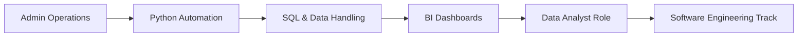
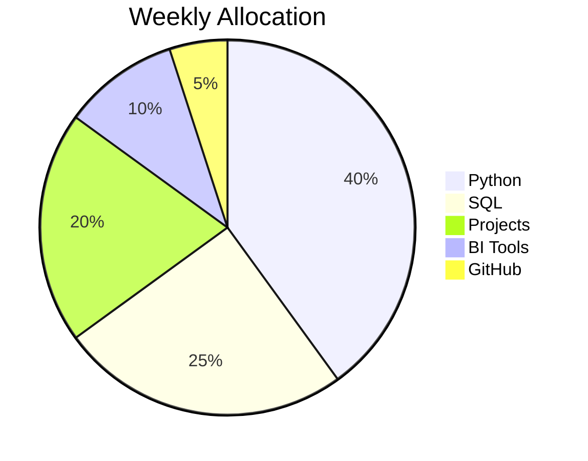

````markdown
<!-- ──────────────────────────────────────────────── -->
<!--  VINICIUS SOARES BRANDÃO | CLASSIFIED PROFILE  -->
<!-- ──────────────────────────────────────────────── -->

<div align="center">

# 🕶️ VINICIUS SOARES BRANDÃO


<br><br>

> “Precision. Discipline. Execution.”

</div>

---

## 📁 DOSSIER

```txt
IDENTITY:     Vinicius Soares Brandão
AGE:          22
BASE OF OPS:  São Paulo, Brazil
CURRENT ROLE: Administrative Sector
OBJECTIVE:    Data Analytics / Business Intelligence
STATUS:       Career transition in progress
````

---

## 🎯 MISSION BRIEFING

* Transition from administrative operations → Data & BI
* Build technical mastery in Python & SQL
* Develop real-world analytical projects
* Establish a strong GitHub portfolio
* Progress toward Software Engineering track

---

## 🧬 TRANSFORMATION PATH



---

## 📊 OPERATIONAL FOCUS



---

## ⚙️ TOOLKIT (ACTIVE TRAINING)

<div align="center">


</div>

---

## 🧠 OPERATING CODE

```txt
DISCIPLINE  > MOTIVATION
CONSISTENCY > INTENSITY
EXECUTION   > THEORY
RESULTS     > WORDS
```

---

## 📂 PROJECT STATUS

```diff
+ INITIALIZING PORTFOLIO...
! FIRST PROJECT: NOT DEPLOYED
- REPOSITORIES: CLEAN
```

---

## 🕶️ FINAL STATEMENT

```bash
$ echo "Silent work. Clean execution. Measurable results."
Vinicius Soares Brandão
```

---

```
```
