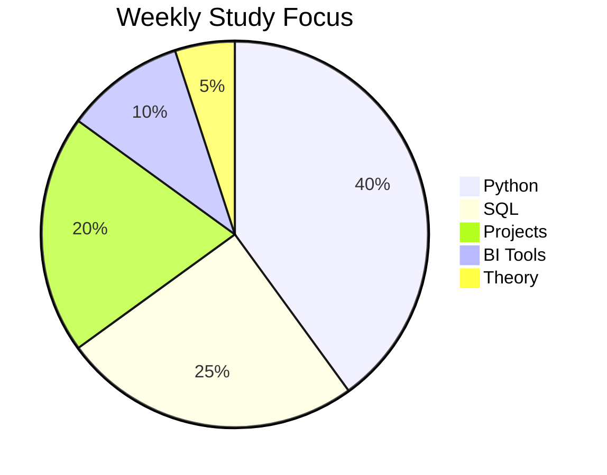

````markdown
<!-- ============ VINICIUS SOARES BRANDÃO — GITHUB PROFILE ============ -->

<a href="#">
  
</a>

<div align="center">


<br>


</div>

---

## 🕶️ PROFILE DOSSIER

```txt
Name        : Vinicius Soares Brandão
Age         : 22
Location    : São Paulo, Brazil 🇧🇷
Current Role: Administrative Sector
Goal        : Data Analyst / BI Specialist
Future      : Software Engineering
Status      : Active transition
````

---

## 🎯 OBJECTIVE

Transform raw data into business decisions.

* Python for automation & analysis
* SQL for data extraction
* BI for dashboards & insights
* Real-world portfolio building

---

## 🧬 TRANSFORMATION PATH


---

## ⚙️ TECH STACK (IN PROGRESS)

<div align="center">


</div>

---

## 📊 FOCUS DISTRIBUTION



---

## 📂 PROJECT STATUS

| Project        | Description         | Status         |
| -------------- | ------------------- | -------------- |
| Python Studies | Exercises & scripts | 🟡 In progress |
| Data Portfolio | Analytics projects  | 🔴 Not started |
| BI Dashboards  | Power BI dashboards | 🔴 Not started |

---

## 📈 GITHUB STATS

<div align="center">


</div>

---

## 🧠 PHILOSOPHY

```txt
Discipline > Motivation  
Execution > Theory  
Consistency > Intention  
Systems > Chaos  
```

---

## 🕶️ FINAL NOTE

> “Quiet consistency builds visible results.”

```
```

