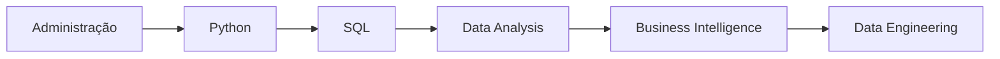
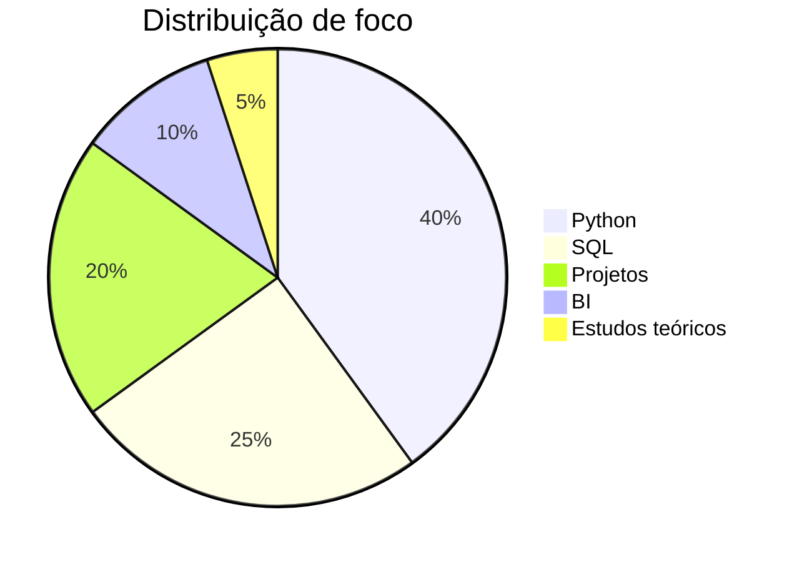

````markdown
<!-- ============ VINICIUS BRANDÃO — PROFILE README ============ -->

<a href="#">
  
</a>

<div align="center">

[](#)
[](#)


<a href="https://git.io/typing-svg">

</a>

</div>

---


### `> whoami`

```ts
const vinicius = {
  base: "São Paulo, Brasil 🇧🇷",
  foco: ["Data Analytics", "Business Intelligence", "Python", "SQL"],
  stack: ["Python", "SQL", "Excel", "Power BI", "Git"],
  filosofia: "Transformar dados em decisão.",
  status: "Transição de carreira ativa (Administração → Dados)"
};
````

<br clear="right"/>

---

## 🧰 Arsenal

<div align="center">


</div>

---

## 📂 Projetos

| Projeto            | Descrição                           | Status          |
| ------------------ | ----------------------------------- | --------------- |
| Python Studies     | Scripts e exercícios de aprendizado | 🟡 Em andamento |
| Data Analytics Lab | Projetos com Python + SQL           | 🔴 Não iniciado |
| BI Dashboard Set   | Dashboards no Power BI              | 🔴 Não iniciado |

---

## 🧬 Roadmap de Evolução



---

## 📊 Foco Atual



---

## 📈 Métricas GitHub

<div align="center">


</div>

---

## 🧠 Filosofia

```txt
Discipline > Motivation
Execution > Theory
Consistency > Intention
Systems > Chaos
```

---

## 🕶️ Closing Statement

> “Quiet execution builds undeniable results.”

```
```
